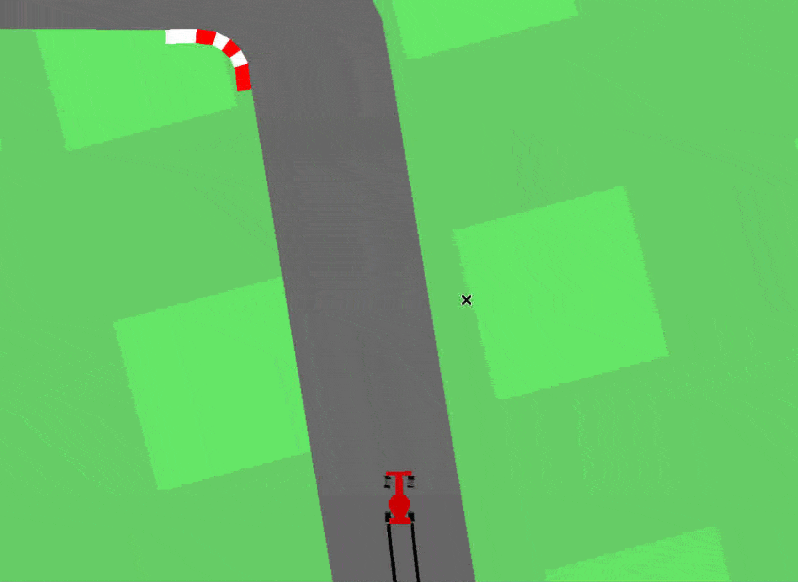
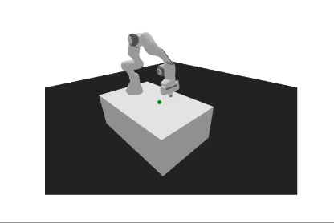

# Nouveau Variational Autoencoder (NVAE) based World Models 

## Overview

This GitHub repository hosts the implementation of the thesis project, " A Deep Hierarchical Variational Autoencoder for World Models in Complex Reinforcement Learning Environments." Model-based reinforcement learning (MBRL) approaches have emerged as a promising solution for sample-efficient and robust reinforcement learning agents, leveraging learned models of the environment to plan and make optimal decisions, thereby reducing the need for extensive real-world interactions.

The project focuses on the World Models paradigm, a model-based RL approach utilizing generative neural network models to learn a compressed spatial and temporal representation of the environment. Traditional variational autoencoders (VAE) are commonly employed in this paradigm to encode environment features into latent representations. However, recent research has unveiled that the constraints of traditional VAEs can lead to information loss or distortion during compression, hindering the agent's ability to learn accurate representations of complex environments.

To overcome these challenges, this thesis proposes the use of a deep hierarchical variational autoencoder (NVAE) as the visual component of the World Models. NVAE, with its ability to model complex data and long-range correlations, aims to enhance the agent's performance in complex RL environments such as car racing-v2 and panda-gym.


**Research Paper:**
In tandem with this thesis project, a corresponding research paper has been accepted. This paper delves deeper into the methodologies, experiments, and results, offering additional insights into the development and outcomes. For a comprehensive understanding, you can access the full paper titled "Deep Hierarchical Variational Autoencoders with World Models in Reinforcement Learning" [here](https://doi.ieeecomputersociety.org/10.1109/TransAI60598.2023.00039).

## Prerequisites

- **Python:** This project is written in Python. You can download it from [python.org](https://www.python.org/downloads/).
- **PyTorch:** Install PyTorch by following the instructions on the official PyTorch website:
  - For CPU only:
     ```bash
        pip install torch==1.10.0+cpu torchvision==0.11.1+cpu torchaudio==0.10.0+cpu -f https://download.pytorch.org/whl/cpu.html
     ```

  - For CUDA 11.1:
     ```bash
        pip install torch==1.10.0+cu111 torchvision==0.11.1+cu111 torchaudio==0.10.0+cu111 -f https://download.pytorch.org/whl/cu111.html
     ```
 Replace the version numbers with the latest stable release available from the [PyTorch website](https://pytorch.org/get-started/locally/).

- **Dependencies:** Install the required dependencies using the following command:

  ```bash
  pip install -r requirements.txt
  ```

## Results

### Car Racing Experiment (carracing_nvae) -  Dream Car Racing-v2 Task

- **Average Score:** Achieved an impressive average score of 887±18, surpassing the previous world models agent (613±16).
- **FID Score (Image Reconstruction):**
  - NVAE: 164.67
  - Traditional VAE: 271.58 (Lower FID scores indicate better image reconstruction).

#### GIF: Dream Car Racing-v2 Task




### Panda-Gym Reach Experiment (panda_gym-Reach) - Reach Task Performance

- **Success Rate:** Demonstrated a robust 95% success rate in the reaching task.
- **Comparison with Model-Free Reinforcement Learning (MFRL) Approaches:**
  - Our MBRL approach with NVAE achieved competitive results against MFRL methods like SAC, TD3, and DDPG with HER.
  - Notably, our model's performance aligns with the 100% success rate achieved by DDPG with HER.

#### GIF: Reach Task Performance



## Conclusion

The presented results showcase the efficacy of the NVAE-based World Models in both the dream car racing-v2 and Panda-Gym Reach tasks. Notable achievements include an impressive average score in the dream car racing-v2 task, outperforming previous models, and competitive performance in reaching tasks compared to MFRL approaches.


