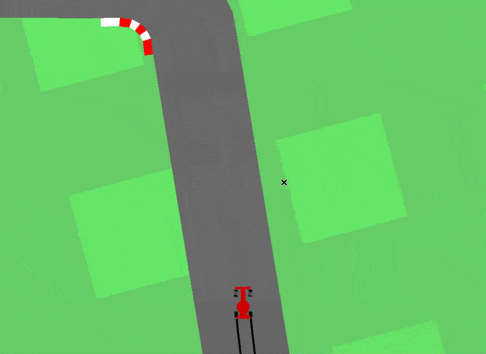
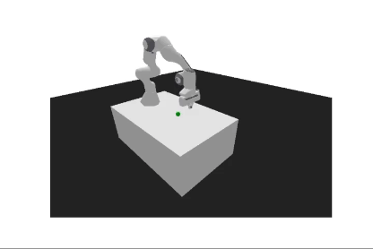

# Nouveau Variational Autoencoder (NVAE) based World Models

This repository contains research code and saved artifacts associated with my M.S. research and the resulting first-author IEEE TransAI 2023 publication.

## Overview

This repository contains code and experimental artifacts from my M.S. thesis project, "A Deep Hierarchical Variational Autoencoder for World Models in Complex Reinforcement Learning Environments." Model-based reinforcement learning (MBRL) approaches have emerged as a promising solution for sample-efficient and robust reinforcement learning agents, leveraging learned models of the environment to plan and make optimal decisions, thereby reducing the need for extensive real-world interactions.

The project focuses on the World Models paradigm, a model-based RL approach utilizing generative neural network models to learn a compressed spatial and temporal representation of the environment. Traditional variational autoencoders (VAEs) are commonly employed in this paradigm to encode environment features into latent representations. However, recent research has unveiled that the constraints of traditional VAEs can lead to information loss or distortion during compression, hindering the agent's ability to learn accurate representations of complex environments.

To overcome these challenges, this thesis proposes the use of a deep hierarchical variational autoencoder (NVAE) as the visual component of the World Models. NVAE, with its ability to model complex data and long-range correlations, aims to enhance the agent's performance in RL environments such as CarRacing-v2 and Panda-Gym.

**Research Paper:**  
*Deep Hierarchical Variational Autoencoders with World Models in Reinforcement Learning*, IEEE TransAI 2023. [Paper / DOI](https://doi.ieeecomputersociety.org/10.1109/TransAI60598.2023.00039)

## Environment Notes

Historical dependency files are stored with each experiment:

- `carracing_nvae/requirements.txt` and `carracing_nvae/carracing_nvae.yaml`
- `panda_gym-Reach/requirements.txt` and `panda_gym-Reach/panda_gym_Reach.yaml`

## Results

The results below are reported in the associated IEEE TransAI 2023 publication.

### Car Racing Experiment (carracing_nvae) -  Dream Car Racing-v2 Task

- **Average return:** 887 ± 18, compared with 613 ± 16 for the VAE baseline.
- **FID:** NVAE 164.67 vs. traditional VAE 271.58.

#### GIF: Dream Car Racing-v2 Task

### Panda-Gym Reach Experiment (panda_gym-Reach) - Reach Task Performance

- **Success rate:** 95% on PandaReach-v2.

#### GIF: Reach Task Performance

## Acknowledgements

This work builds on the World Models framework and the open-source PyTorch World Models implementation by ctallec: https://github.com/ctallec/world-models
